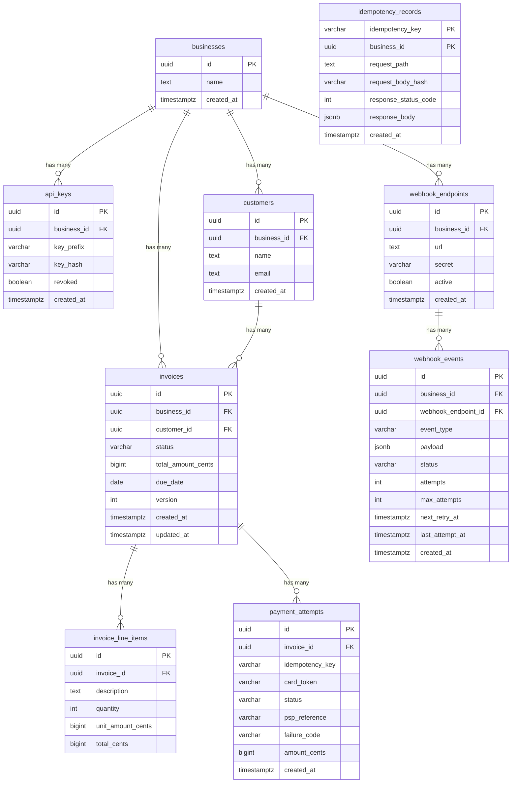

# DESIGN.md — Invoice & Payment Service

## 1. Data Model

### ER Diagram (Mermaid)



### Key Design Decisions

- **UUIDs as primary keys**: Avoids sequential ID enumeration attacks, safe for distributed generation. Trade-off: larger index footprint than bigint.
- **Money as `bigint` (cents)**: No floats anywhere. `total_cents = quantity * unit_amount_cents` is always integer math. The `BIGINT` type handles up to ~$92 quadrillion in cents, far beyond any practical need.
- **`version` column on invoices**: Used by JPA `@Version` for optimistic concurrency control as a secondary guard alongside pessimistic locking.
- **Composite PK on `idempotency_records`**: `(idempotency_key, business_id)` — keys are scoped per-business so different businesses can reuse the same key string without collision.
- **Partial indexes**: `idx_api_keys_prefix WHERE NOT revoked` and `idx_webhook_events_pending WHERE status = 'pending'` keep index size small and lookups fast.
- **Status stored as `varchar` with CHECK constraints**: Simpler than a separate lookup table; the CHECK constraint at the DB level enforces valid values regardless of application bugs.

### At 100x Scale

- Partition `invoices` and `payment_attempts` by `created_at` (range partitioning) for efficient cleanup and archival.
- Move `idempotency_records` to Redis with TTL (24h) — these are hot, write-heavy, and ephemeral.
- Shard by `business_id` using Citus or application-level routing.
- Add `invoice_number` (human-readable sequential per-business) since UUIDs are bad for customer communication.

---

## 2. Invoice State Machine

```
                ┌──────────┐
                │  DRAFT   │
                └────┬─────┘
                     │
            ┌────────┴────────┐
            │                 │
     POST /finalize     POST /void
            │                 │
            ▼                 ▼
       ┌────────┐       ┌────────┐
       │  OPEN  │       │  VOID  │ (terminal)
       └───┬────┘       └────────┘
           │
     ┌─────┼──────────────┐
     │     │              │
  payment  POST /void   POST /mark-
  succeeds              uncollectible
     │     │              │
     ▼     ▼              ▼
  ┌──────┐ ┌──────┐  ┌───────────────┐
  │ PAID │ │ VOID │  │ UNCOLLECTIBLE │
  └──────┘ └──────┘  └───────────────┘
 (terminal) (terminal)   (terminal)
```

### Transitions

| From | To | Trigger | Reversible? |
|------|----|---------|-------------|
| `draft` | `open` | `POST /invoices/{id}/finalize` | No |
| `draft` | `void` | `POST /invoices/{id}/void` | No |
| `open` | `paid` | Successful payment via `POST /invoices/{id}/pay` | No |
| `open` | `void` | `POST /invoices/{id}/void` | No |
| `open` | `uncollectible` | `POST /invoices/{id}/mark-uncollectible` | No |

### Terminal States

`paid`, `void`, and `uncollectible` are **terminal** — no transitions out. The API returns 409 Conflict with a clear error message for any attempt to transition out of a terminal state.

### Invalid Transition Rejection

The `InvoiceService.validateTransition()` method checks the `VALID_TRANSITIONS` map. If the requested transition is not in the allowed set for the current state, the API returns:
```json
{
  "status": 409,
  "error": "conflict",
  "message": "Invalid state transition: draft -> paid"
}
```

---

## 3. Payment Correctness & Failure Modes

### Concurrency Mechanism: Pessimistic Row-Level Lock

I use `SELECT ... FOR UPDATE` on the invoice row inside a `@Transactional` method. This is a **pessimistic row-level lock** in PostgreSQL.

**Why this over alternatives:**
- **Optimistic concurrency** (version check at commit time): Fine for low contention, but for payments, a failed optimistic check means the PSP was already called — potential double-charge. Pessimistic lock prevents that by serializing access *before* the PSP call.
- **Advisory locks**: More flexible but harder to reason about, easy to leak, and require manual lifecycle management.
- **Serializable isolation**: Correct but broad — serializes *all* transactions, not just those touching the same invoice. Too much contention.
- **Status-conditional UPDATE** (`UPDATE ... WHERE status = 'open'`): Prevents invalid transitions but doesn't prevent two concurrent PSP calls for the same invoice.

### (a) Two Concurrent POST /pay Requests

1. Thread A acquires the `FOR UPDATE` lock on the invoice row.
2. Thread B blocks waiting for the lock.
3. Thread A calls the PSP, gets success, sets invoice to `paid`, commits, releases lock.
4. Thread B acquires the lock, reads the invoice, sees `status = 'paid'`, returns **409 Conflict**.

**Result**: Exactly one payment succeeds. No double-charge. The concurrency test verifies this with 10 simultaneous threads.

### (b) PSP Timeout (tok_timeout, 30s)

1. The `PspClient` has a **5-second HTTP read timeout**.
2. `tok_timeout` causes the PSP to sleep for 30 seconds.
3. After 5 seconds, the HTTP client throws `ResourceAccessException`.
4. The `catch` block sets the payment attempt to `pending` with `failure_code = "psp_timeout"`.
5. The invoice remains `open`.
6. The API returns a 200 with `status: "pending"` in the response body.

**How the caller finds the result**: The caller can poll `GET /invoices/{id}` to check the status. In production, a reconciliation background job would query the PSP for the outcome of pending payment attempts and update the state. This is documented but not built (see Section 6).

### (c) PSP Returns Success, Service Crashes Before Persisting

1. The PSP call succeeds, but the JVM crashes before the `@Transactional` commit.
2. The database transaction rolls back — the payment_attempt is NOT persisted, the invoice stays `open`.
3. On retry, the client sends the same `Idempotency-Key`.
4. No cached idempotency record exists (it was rolled back), so we re-process.
5. The PSP call uses the **same idempotency key** that was passed to the mock PSP, which returns the cached result (no second charge).

**Result**: No double-charge, because the PSP is idempotent on its side. The mock PSP implements this via a `ConcurrentHashMap` keyed by idempotency_key.

### (d) Idempotency Key Reused with Different Body

The `idempotency_records` table stores a SHA-256 hash of the request body alongside the key. On reuse:
1. Look up the record by `(idempotency_key, business_id)`.
2. Compare the stored `request_body_hash` with the hash of the new request body.
3. If they differ, return **422 Unprocessable Entity** with message: "Idempotency key already used with a different request body".

### (e) POST /pay on a Paid Invoice

The payment handler checks `invoice.status` after acquiring the lock. If the status is not `open`, it returns **409 Conflict**: "Invoice cannot be paid. Current state: paid. Only invoices in 'open' state can be paid."

Additionally, if there is an existing `pending` payment attempt for this invoice, new payment attempts are rejected with 409, preventing potential double-charges during PSP timeout scenarios.

---

## 4. Webhook Design

### Signing Scheme

- **Algorithm**: HMAC-SHA256
- **Secret**: Generated per-endpoint at registration time (`whsec_` + 32 random bytes, base64url-encoded). Shown once, never stored in plaintext in responses after creation.
- **Signed data**: `"{unix_timestamp}.{json_payload}"`
- **Header**: `X-Webhook-Signature: t=1695000000,v1=<hex_hmac>`

**Replay protection**: The timestamp is embedded in the signed data. Receivers should reject signatures where the timestamp is more than 5 minutes old. This follows the same pattern as Stripe's webhook signatures.

### Retry Policy

| Attempt | Delay After Failure |
|---------|-------------------|
| 1 | Immediate |
| 2 | 60 seconds |
| 3 | 5 minutes |
| 4 | 30 minutes |
| 5 | 2 hours |

**Total budget**: ~2.5 hours from first attempt to final retry.

After 5 failed attempts, the event is marked as `failed` in the database. It remains in the `webhook_events` table for debugging and manual reconciliation.

### Missed Event Reconciliation

A business can reconcile missed events by:
1. Listing invoices by status and checking against their own records.
2. In production, we'd add a `GET /webhook-events?status=failed` endpoint for businesses to see failed deliveries and replay them.

### Decoupling from API Path

Webhook events are written to the `webhook_events` table inside the same transaction as the invoice/payment state change (default `REQUIRED` propagation). This means webhook events commit atomically with the business state — if the transaction rolls back, no orphan events are created. A separate `@Scheduled` background worker polls every 2 seconds for pending events and delivers them asynchronously. This ensures:
- The API response is never blocked by webhook delivery.
- Webhook failures don't affect the payment transaction.
- Events survive application restarts (they're in the database, not in memory).

---

## 5. API Key Model

| Aspect | Implementation |
|--------|---------------|
| **Generation** | `dodo_` prefix + 32 cryptographically random bytes (base64url). Total ~49 characters. |
| **Storage** | SHA-256 hash stored in `key_hash`. The raw key is **never stored**. |
| **Prefix** | First 12 characters stored in `key_prefix` for fast lookup. The prefix is not secret. |
| **Lookup** | Filter by prefix (indexed), then constant-time comparison of the full hash. |
| **Transmission** | Sent via `Authorization: Bearer <key>` header over HTTPS. |
| **Shown once** | The full key is returned only at creation time. Cannot be retrieved afterward. |
| **Revocation** | `DELETE /api-keys/{id}` sets `revoked = true`. The partial index excludes revoked keys. |
| **Rotation** | Create a new key, migrate clients, then revoke the old one. Both keys work simultaneously during migration. |

### Blast Radius if Leaked

- A leaked key gives access to **one business only** (scoped).
- It cannot escalate to other businesses.
- Revocation is immediate — set `revoked = true`.
- In production: add short-lived tokens or key expiration dates. Log all API key usage for audit.

---

## 6. What I Cut and Why

1. **Payment reconciliation background job**: For `tok_timeout` / pending payments, a real system would have a background job that polls the PSP to resolve pending payment attempts. I chose to leave payments as `pending` and document the gap rather than build a reconciliation system, because the core correctness of the payment flow is demonstrated through the state machine and locking.

2. **Refunds and partial payments**: The domain model supports tracking them (add a `refunds` table and allow partial `amount_cents` in payment_attempts), but they add significant state machine complexity (e.g., `paid` → `partially_refunded` → `refunded`). Not worth the risk of bugs in a time-boxed assignment.

3. **Rate limiting**: In production, API key-scoped rate limiting (e.g., 100 req/s per key via a token bucket in Redis) is essential. I chose to omit it rather than build a half-measure. The `/businesses` endpoint is especially important to rate limit since it's unauthenticated.

4. **Idempotency key expiration**: In production, idempotency records should expire after 24-48 hours. Without expiration, the table grows unbounded. A TTL in Redis or a scheduled cleanup job would handle this.

5. **Webhook event replay endpoint**: A `POST /webhook-events/{id}/replay` endpoint would let businesses manually retry failed deliveries. I built the persistence layer to support this but didn't add the endpoint.

---